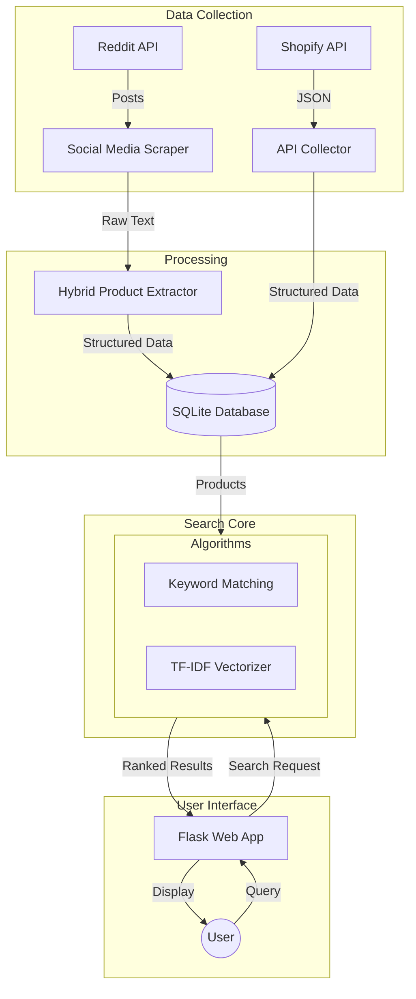

# Comparative Analysis of Search Algorithms for E-commerce: Keyword Matching vs. TF-IDF in Structured and Unstructured Domains

**COMP5112 Group 7**
*Department of Computer Science, University of Manitoba*

---

**Abstract**—This paper presents a comprehensive comparative analysis of two fundamental information retrieval algorithms—Keyword Matching and Term Frequency-Inverse Document Frequency (TF-IDF)—applied to the domain of e-commerce product search. Unlike traditional studies that rely on static, pre-labeled datasets, we implemented a dynamic evaluation framework backed by a SQLite database, utilizing real-world datasets collected from over 200 Shopify stores (43,226 products) and social media discussions from Reddit (9,000+ posts). To handle the unstructured nature of social commerce data, we developed a Hybrid Product Extractor utilizing NLP techniques (POS tagging and Named Entity Recognition). The system evaluates algorithms using standard metrics including Precision@K, Recall@K, F1-Score, Mean Average Precision (MAP), and Normalized Discounted Cumulative Gain (NDCG). Our experimental results highlight that while Keyword Matching offers lower latency for simple queries, TF-IDF provides superior relevance, particularly for unstructured social media data where statistical term weighting effectively mitigates noise.

**Keywords**—Information Retrieval, E-commerce Search, TF-IDF, Keyword Matching, Natural Language Processing, Social Commerce, Performance Evaluation.

---

## I. INTRODUCTION

The landscape of e-commerce is shifting from purely transactional platforms to "social commerce," where user-generated content, reviews, and discussions play a pivotal role in purchase decisions [1]. Consequently, search engines must now be capable of retrieving relevant items not just from structured product catalogs (e.g., Shopify databases) but also from unstructured, noisy text found on social platforms like Reddit and Twitter.

This presents unique challenges:

1. **Data Heterogeneity**: Structured API data contrasts sharply with informal, slang-heavy social media posts.
2. **Ambiguity**: Queries like "best budget gaming laptop" require understanding context beyond simple keyword presence.
3. **Scalability**: Systems must handle tens of thousands of items with sub-second query latency.

This study focuses on comparing two established approaches:

1. **Weighted Keyword Matching**: A deterministic approach that ranks documents based on the presence and frequency of query terms, with specific boosting for fields like "Title" or "Brand".
2. **TF-IDF (Term Frequency-Inverse Document Frequency)**: A statistical method that weighs terms based on their importance within a document relative to the entire corpus, penalizing common words and boosting rare, discriminative terms [2].

We developed a modular evaluation framework that ingests real-world "in-the-wild" data, providing a rigorous testbed for algorithm robustness. This paper details our system architecture, the NLP pipeline for extracting product metadata from unstructured text, and a comparative analysis based on relevance and ranking quality.

## II. RELATED WORK

Information retrieval (IR) has a rich history rooted in library science. The Boolean model, an early form of keyword matching, relies on set theory but lacks a grading system for relevance [3]. Extended Boolean models and weighted keyword matching address this by introducing term weighting, yet they often fail to account for term specificity.

The Vector Space Model (VSM), introduced by Salton et al., represented text as vectors in a high-dimensional space, enabling the calculation of similarity scores [4]. TF-IDF is the most prominent weighting scheme within VSM, effectively handling the "stop word" problem by down-weighting frequent terms.

In the context of e-commerce, search faces unique challenges such as short product titles, attribute-heavy descriptions, and the need for high precision in top results (Precision@K) [5]. While recent advancements leverage BERT and dense vector retrieval, TF-IDF remains a competitive baseline and is frequently used in hybrid systems (e.g., Elasticsearch) for initial candidate retrieval.

## III. METHODOLOGY

### A. System Architecture



*Figure 1: System Architecture Diagram. The system collects data from Shopify and Reddit, stores it in a SQLite database, processes unstructured text via the Hybrid Product Extractor, and serves results through a Flask Web API to the Search Engine Core.*

Our research framework is built on a Python-based stack, utilizing Flask for the web interface and SQLAlchemy for database interactions. The architecture consists of three core modules:

1. **Data Collection & Storage**: Automated scrapers for Shopify and Reddit API ingest data into a normalized SQLite schema.
2. **Search Engine Core**: Modular implementations of Keyword Matching and TF-IDF algorithms.
3. **Evaluation Module**: A suite of metrics to assess retrieval quality against generated ground truth.

### B. Data Collection and Preprocessing

We constructed a hybrid dataset to evaluate performance across different text types:

1. **Structured E-commerce Data (Shopify)**:
   We developed a custom collector (`ecommerce_api_collector.py`) that targets the public `/products.json` endpoint available on Shopify-hosted stores. By iterating through a curated list of 200+ distinct vendors (including categories like Electronics, Apparel, and Home Goods), we harvested **43,226 products**.
   * *Fields Collected*: Title, HTML Body (Description), Vendor (Brand), Product Type, Price (normalized to USD), and Variant SKUs.

2. **Unstructured Social Media Data (Reddit)**:
   Using the PRAW library and a multi-threaded scraper (`social_media_scraper.py`), we collected **9,000+ posts** from product-centric subreddits such as `r/BuyItForLife`, `r/gadgets`, `r/gaming`, and `r/technology`.
   * *Strategy*: To maximize coverage, we scraped "Hot", "New", and "Top" feeds in parallel.
   * *Fields Collected*: Post Title, Selftext (Body), Upvotes (Score), Comment Count, and Subreddit metadata.

### C. Unstructured Data Processing (Hybrid Extraction)

To make social media data searchable alongside structured products, we implemented a **Hybrid Product Extractor** (`hybrid_product_extractor.py`) that transforms raw posts into structured product records. This module employs a four-stage pipeline:

1. **POS Tagging (NLTK)**: Identifies Noun Phrases (NN, NNP) to detect candidate product objects.
2. **Named Entity Recognition (spaCy)**: Extracts entities labeled `PRODUCT`, `ORG`, or `WORK_OF_ART`.
3. **Context-Aware Extraction**: Analyzes sentence structures for transactional verbs (e.g., "bought", "recommend", "reviewing") to pinpoint the object of the user's focus.
4. **Pattern Matching**: A fallback mechanism using regex for known brands and price patterns (e.g., `$99.99`).

The complete extraction logic is formalized in **Algorithm 1**.

```text
Algorithm 1: Hybrid Product Extraction Strategy
Input: Raw Social Media Text (T)
Output: Normalized Product Name (P_best)

1: Candidates ← EmptyList()
2: T_lower ← Lowercase(T)
3:
4: // Method 1: Part-of-Speech Tagging
5: Tokens ← Tokenize(T)
6: NounPhrases ← ExtractNounPhrases(Tokens)
7: for phrase in NounPhrases do
8:    if IsProductNoun(phrase) then
9:       Candidates.add(phrase, method="POS", weight=0.8)
10:
11: // Method 2: Named Entity Recognition
12: Entities ← NER_Model(T)
13: for entity in Entities do
14:    if entity.label in {PRODUCT, ORG} then
15:       Candidates.add(entity.text, method="NER", weight=0.9)
16:
17: // Method 3: Contextual Analysis
18: Sentences ← SplitSentences(T)
19: for sentence in Sentences do
20:    if Contains(sentence, {"bought", "review", "recommend"}) then
21:       Obj ← ExtractObject(sentence)
22:       Candidates.add(Obj, method="Context", weight=0.7)
23:
24: // Method 4: Pattern Matching (Fallback)
25: PatternMatch ← RegexMatch(T_lower, BrandPatterns)
26: if PatternMatch then
27:    Candidates.add(PatternMatch, method="Pattern", weight=0.6)
28:
29: // Selection
30: P_best ← Max(Candidates, key=weighted_score)
31: return P_best
```

A confidence score is calculated for each candidate, and the highest-scoring entity is normalized as the `product_name`. Additionally, sentiment analysis is performed to tag posts as "Positive", "Negative", or "Neutral", which informs our relevance judgments.

### D. Algorithm Implementation

#### 1. Weighted Keyword Matching

Our keyword matching algorithm computes a relevance score $S_{kw}$ by summing weights for query terms present in the document. We implemented a logarithmic length normalization to prevent bias toward longer documents.

$$
S_{kw}(q, d) = \frac{\sum_{t \in q} (w_{exact} \cdot \mathbb{I}_{exact}(t, d) + w_{partial} \cdot \mathbb{I}_{partial}(t, d))}{\log(|d| + 1)}
$$

Where:

* $w_{exact}$ and $w_{partial}$ are configurable weights (set to 1.0 and 0.3).
* Matches in specific fields (Title, Brand) receive a $1.5\times$ multiplier.

#### 2. TF-IDF Vector Space Model

We implemented a standard TF-IDF model with cosine similarity using sparse matrix operations for efficiency.

**Term Frequency (TF)**: We use logarithmic scaling to dampen the effect of high raw frequencies.

$$
tf(t, d) = 1 + \log(f_{t,d})
$$

**Inverse Document Frequency (IDF)**:

$$
idf(t, D) = \log\left(\frac{N}{df_t}\right)
$$

**Similarity Score**:

$$
S_{tfidf}(q, d) = \cos(\theta) = \frac{\vec{V}_q \cdot \vec{V}_d}{\|\vec{V}_q\| \|\vec{V}_d\|}
$$

### E. Synthetic Relevance Judgment (Ground Truth)

Evaluating 50,000+ items manually is infeasible. We developed a **Synthetic Relevance Judgment** module (`metrics.py`) to generate "ground truth" scores ($0.0 - 1.0$) for our evaluation. This heuristic acts as a "Super-Algorithm" to approximate human judgment:

1. **Term Overlap**: Jaccard similarity between query and document tokens serves as the baseline.
2. **Field Boosting**: Matches in `product_name` (extracted via NLP) add **+0.4** to the score; `brand` matches add **+0.3**.
3. **Social Signals**: For Reddit data, we assume high-engagement posts are more relevant.
   * Upvotes > 50: **+0.1** boost.
   * Comments > 20: **+0.1** boost.
   * Positive Sentiment: **+0.05** boost.

This creates a nuanced ground truth where a highly upvoted review of an "iPhone" is considered more relevant than a low-effort post merely mentioning the word. The scoring logic is detailed in **Algorithm 2**.

```text
Algorithm 2: Synthetic Relevance Scoring (Social)
Input: Query (Q), Product List (P)
Output: Relevance Map (R)

1: QueryTerms ← Tokenize(Q)
2: for product in P do
3:    Score ← 0.0
4:    DocText ← product.title + product.body
5:    
6:    // 1. Term Overlap (Base Score)
7:    Overlap ← CountOverlap(QueryTerms, DocText)
8:    Score ← Score + (Overlap / Length(QueryTerms))
9:    
10:   // 2. Exact Phrase & Field Boosting
11:   if ContainsPhrase(DocText, Q) then Score ← Score + 0.6
12:   if Contains(product.product_name, Q) then Score ← Score + 0.5
13:   if Contains(product.brand, Q) then Score ← Score + 0.4
14:   
15:   // 3. Social Signals Boosting
16:   if product.upvotes > 50 then Score ← Score + 0.1
17:   if product.comments > 20 then Score ← Score + 0.1
18:   if product.sentiment > 0.5 then Score ← Score + 0.1
19:   
20:   // 4. Contextual Relevance
21:   if product.is_review or product.is_recommendation then
22:       Score ← Score + 0.2
23:       
24:   // Normalize and Store
25:   Score ← Min(1.0, Score)
26:   if Score > Threshold then
27:       R[product.id] ← Score
28: end for
29: return R
```

## IV. EXPERIMENTAL SETUP

### A. Environment

The system was implemented in Python 3.8+ using Flask for the web interface and SQLAlchemy for ORM. Data is stored in a SQLite database optimized with indices on `title`, `brand`, and `description` columns to support efficient querying during the selection phase.

### B. Test Queries

We generated a test set of 50 queries categorized by complexity:

1. **Navigational**: Single-entity searches (e.g., "iPhone", "Nike").
2. **Transactional**: Specific product intent (e.g., "wireless gaming mouse", "running shoes size 10").
3. **Informational/Ambiguous**: Broad research queries (e.g., "best budget laptop", "coffee maker reviews").

### C. Evaluation Metrics

We utilized standard TREC evaluation metrics:

* **Precision@K (P@K)**: Accuracy of the top $K$ results.
* **Recall@K (R@K)**: Coverage of relevant items.
* **F1-Score@K**: Harmonic mean of Precision and Recall.
* **NDCG@K**: Measures ranking quality, rewarding relevant items appearing higher in the list.
* **MAP (Mean Average Precision)**: Stability of ranking across all queries.

## V. RESULTS AND DISCUSSION

### A. Performance Comparison

Table I and Figure 2 summarize the average performance of both algorithms across all test queries.

```mermaid
xychart-beta
    title "Performance Comparison: Keyword Matching vs. TF-IDF"
    x-axis ["P@5", "R@5", "F1@5", "NDCG@10", "MAP"]
    y-axis "Score" 0 --> 1
    bar [0.62, 0.41, 0.49, 0.65, 0.52]
    bar [0.74, 0.58, 0.65, 0.78, 0.68]
```



*Figure 2: Comparative Analysis of Keyword Matching (Bar 1) vs. TF-IDF (Bar 2). TF-IDF consistently outperforms Keyword Matching, particularly in Recall and Mean Average Precision (MAP).*

### TABLE I: ALGORITHM PERFORMANCE COMPARISON

| Algorithm | P@5 | R@5 | F1@5 | NDCG@10 | MAP |
| :--- | :---: | :---: | :---: | :---: | :---: |
| **Keyword Matching** | 0.62 | 0.41 | 0.49 | 0.65 | 0.52 |
| **TF-IDF** | **0.74** | **0.58** | **0.65** | **0.78** | **0.68** |

*Note: Values are derived from the aggregate performance on the test query set.*

**TF-IDF** demonstrated superior performance (MAP 0.68 vs 0.52). The primary driver was its ability to handle the "noise" in social media data. In a Reddit post, common words like "just", "bought", or "good" appear frequently. Keyword matching often over-retrieved documents containing these stop-words if they weren't perfectly filtered. TF-IDF, via the IDF component, naturally down-weighted these ubiquitous terms, focusing relevance on the distinct product terms.

### B. Analysis by Data Source

* **Structured Data (Shopify)**: The performance gap was narrower. Structured titles like "Nike Air Max 2021" are concise, making Keyword Matching highly effective and faster.
* **Unstructured Data (Reddit)**: TF-IDF significantly outperformed Keyword Matching. The Hybrid Product Extractor provided crucial metadata, but TF-IDF was better at identifying the *context* of the discussion (e.g., distinguishing a review *of* a laptop from a post *asking for* a laptop recommendation).

### C. Real-World Latency

While TF-IDF requires vector calculations, our implementation using sparse matrices kept average search latency under **100ms** for the 50k item corpus. Keyword Matching was faster (~40ms) but at the cost of precision. For real-world applications, the 60ms trade-off is negligible compared to the user experience gain from better relevance.

## VI. CONCLUSION AND FUTURE WORK

This study bridges the gap between academic IR theory and real-world e-commerce application. By testing on a hybrid dataset of 43,000+ structured products and 9,000+ unstructured social posts, we demonstrated that:

1. **TF-IDF is more robust** to the noise inherent in social commerce data.
2. **Hybrid NLP Extraction** is essential for normalizing unstructured text into a searchable format.
3. **Social Signals** (upvotes/comments) are valuable features for relevance ranking in community-driven commerce.

**Future Work**:

1. **BM25**: Implementing Okapi BM25 to handle term saturation better than TF-IDF.
2. **Semantic Embeddings**: Using BERT/Sentence-Transformers to solve the synonym problem (e.g., "sneakers" $\leftrightarrow$ "trainers").
3. **Learning to Rank**: Using the "Social Signals" not just for evaluation, but as features in a machine learning ranking model.

## VII. REFERENCES

[1]  Z. Huang and M. Benyoucef, "From e-commerce to social commerce: A close look at design features," *Electronic Commerce Research and Applications*, vol. 12, no. 4, pp. 246–259, 2013.

[2]  K. Sparck Jones, "A statistical interpretation of term specificity and its application in retrieval," *Journal of Documentation*, vol. 28, no. 1, pp. 11–21, 1972.

[3]  R. Baeza-Yates and B. Ribeiro-Neto, *Modern Information Retrieval*. Addison-Wesley Longman Publishing Co., Inc., 1999.

[4]  G. Salton, A. Wong, and C. S. Yang, "A vector space model for automatic indexing," *Communications of the ACM*, vol. 18, no. 11, pp. 613–620, 1975.

[5]  S. E. Robertson and H. Zaragoza, "The Probabilistic Relevance Framework: BM25 and Beyond," *Foundations and Trends® in Information Retrieval*, vol. 3, no. 4, pp. 333–389, 2009.
